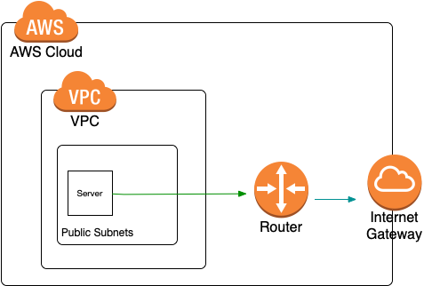

# module-terraform

This module creates a dedicated VPC containing an EC2 host with terraform, git and the AWS CLI installed. The intention is to create an instance that isused as a bootstrap to configure and manage other assets in the AWS account. Note that this VPC is isolated from other VPC/subnets in the account, and all operations against the account are via the AWS API.

Specifically, what is built is roughly as below



The constructed network and instance allows traffic on 22, 80, 443 (plus the ephemeral ports) in and out. SSH is restricted to a defined set of CIDR blocks. The instance is an Amazon Linux 2 instance, and the latest versions of the AWS CLI, Terraform and Git are installed during boot.

Note that the constructed instance is built and intended to have a very wide range of powers, and it definitely should not be used for general purpose access or activity in the AWS account. It's explicitly a super-user box for doing super-user things, and usage should be audited and constrained.

Usage is constrained through three mechanisms, but these mechanisms *must* be enhanced for production use:

  1. SSH access is limited to nominated sources;
  1. There are no private keys on the instance, or SSH password, requiring access through [Instance Connect](https://docs.aws.amazon.com/AWSEC2/latest/UserGuide/Connect-using-EC2-Instance-Connect.html);
  1. A group with privileges allowing Instance Connect access to (only) the instance is provided.

Fairly obviously if you are using Instance Connect with a profile that allows higher privileges than provided by group membership, then group membership will not constrain you.

## Prerequisites
This module does make use of Terraform version constraints (see `versions.tf`) but can be summarised as:

 - Terraform 0.13.4 or above
 - Terraform AWS provider 3.7.0 or above

## Usage
This module is intended to be very simple to use:

```
module vpc {
  source = "github.com/LeapBeyond/module-terraform"

  tags = { Owner = "Robert", Client = "Leap Beyond", Project = "Terraform Module Test" }

  vpc_cidr       = "172.31.100.0/24"
  vpc_name       = "terraform-test"
  ssh_inbound    = ["89.36.68.26/32", "18.202.216.48/29", "3.8.37.24/29", "35.180.112.80/29"]
}
```

| Variable | Comment |
| :------- | :------ |
| tags | a map of strings to use as the common set of tags for all generated assets |
| vpc_cidr | the CIDR block for the VPC. The subnets are created by dividing this into 2 * number of AZ, and it is recommended that a /16 block be used |
| vpc_name | a name for the VPC that is used as a prefix on asset names and tags |
| ssh_inbound | a list of CIDR blocks which are permitted to SSH into public instances |

In this example we allow SSH from a particular client, plus some additional CIDR blocks from AWS. These additional blocks are needed to allow the use of [Instance Connect](https://docs.aws.amazon.com/AWSEC2/latest/UserGuide/Connect-using-EC2-Instance-Connect.html) through the AWS console.

These CIDR blocks are available from AWS:

```
$ wget https://ip-ranges.amazonaws.com/ip-ranges.json
$ jq '.prefixes[] | select(.service=="EC2_INSTANCE_CONNECT") | select(.region=="eu-west-2")' < ip-ranges.json
{
  "ip_prefix": "3.8.37.24/29",
  "region": "eu-west-2",
  "service": "EC2_INSTANCE_CONNECT",
  "network_border_group": "eu-west-2"
}
```

There are a variety of outputs available from the module:

| Variable | Comment |
| :------- | :------ |
| vpc_id         | ID of the VPC that is built |
| vpc_arn        | ARN of the VPC that is build |
| tf_subnet      | CIDR blocks for the subnets in the VPC |
| tf_subnet_id   | ID for the subnets in the VPC |
| eip_tf_address | Elastic IP address associated with the instance |
| tf_sg          | ID of the security group attached to the instance |
| nacl_id        | ID of the NACL attached to the VPC and all the subnets in the VPC |
| instance_id    | ID of the generated instance |
| group_name     | group allowed to use instance connect |

Once set up, you will need to add relevant profiles/users to the created group, and those users can then access the service using Instance Connect:

```
$ mssh -i connect_test i-067b509287e1f5cf4
```

where `connect_test` is the profile to use. Note that while the IP address of the host will not change (as it has an Elastic IP attached to it), there is no guarantee for users that the host has not been destroyed and recreated, changing it's SSH signature in the process. To avoid the potential problems resulting from the host being "remembered" in `~/.ssh/known_hosts` they can easily replace the key, e.g.

```
$ ssh-keygen -R 35.177.199.127
$ ssh-keyscan 35.177.199.127 >> ~/.ssh/known_hosts
$ mssh -i connect_test i-067b509287e1f5cf4
```

and the users should be encouraged to script this up for transparent simplicity.

## License
Copyright 2020 Leap Beyond Emerging Technologies B.V.

Licensed under the Apache License, Version 2.0 (the "License");
you may not use this file except in compliance with the License.
You may obtain a copy of the License at

  http://www.apache.org/licenses/LICENSE-2.0

Unless required by applicable law or agreed to in writing, software
distributed under the License is distributed on an "AS IS" BASIS,
WITHOUT WARRANTIES OR CONDITIONS OF ANY KIND, either express or implied.
See the License for the specific language governing permissions and
limitations under the License.
